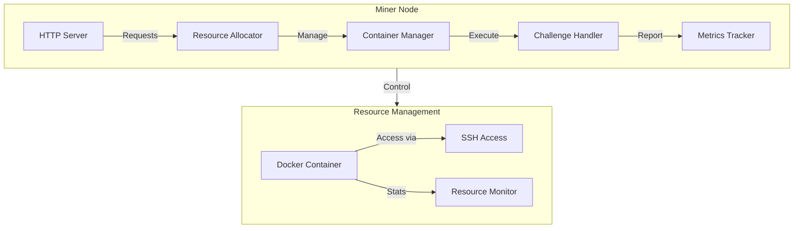
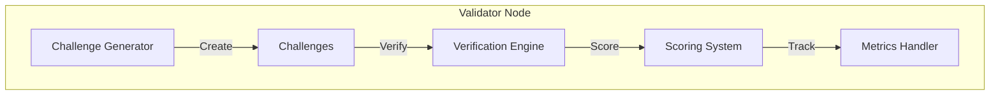

# Polarise Compute Subnet Documentation

## System Overview

Polarise Compute Subnet is a distributed computing system enabling secure resource sharing through containerized environments with robust validation capabilities. The system comprises Miner nodes providing compute resources and Validator nodes ensuring the integrity and performance of these resources through comprehensive verification mechanisms.

### Directory Structure
```
polarise-compute-subnet/
├── src/
│   ├── neurons/
│   │   ├── Miner/
│   │   │   ├── __init__.py
│   │   │   ├── container.py
│   │   │   ├── allocate.py
│   │   │   ├── http_server.py
│   │   │   └── pow.py
│   │   ├── Validator/
│   │   │   ├── __init__.py
│   │   │   ├── challenges.py
│   │   │   ├── verification.py
│   │   │   └── scoring.py
│   │   └── BaseNode/
│   │       └── __init__.py
│   └── utils/
│       ├── crypto.py
│       ├── docker_utils.py
│       └── logging.py
├── tests/
│   ├── test_allocation.py
│   └── test_validator.py
└── config/
    ├── config.yaml
    └── miner.yaml
```

## Architecture

### Miner Node Architecture

### Miner Node Architecture


#### Components Explanation:

- **HTTP Server (API)**: Handles incoming HTTP requests for resource allocation, validation processing, and status retrieval.
- **Resource Allocator (RA)**: Validates resource requests and allocates appropriate resources by interfacing with the Container Manager.
- **Container Manager (CM)**: Manages Docker containers, including creation, deletion, and configuration based on allocated resources.
- **Validation Tracker (VT)**: Oversees the validation processes to ensure resources meet performance and integrity standards.
- **Metrics Tracker (MT)**: Collects and stores metrics from container operations for monitoring and verification.
- **Logger (LOG)**: Maintains logs for all operations within the Miner Node for auditing and debugging purposes.

### Validator Node Architecture


#### Components Explanation:

- **Verification Engine (VE)**: Processes the results from Miner Nodes to determine the validity and performance of resource claims.
- **Scoring System (SS)**: Calculates scores based on verification results to rate the performance and reliability of Miner Nodes.
- **Metrics Handler (MH)**: Manages the collection and storage of metrics related to validation processes.
- **Logger (LOGV)**: Maintains logs for all operations within the Validator Node for auditing and debugging purposes.

## Components

1. Container Management
   ```python
   import docker
   
   class ContainerManager:
       def __init__(self, config):
           self.client = docker.from_env()
           self.config = config
       
       def run_container(self, resources):
           """
           Creates and manages Docker containers with:
           - Resource limits (CPU, Memory)  
           - SSH access
           - Monitoring capabilities 
           - Validation execution environment
           """
           container = self.client.containers.run(...)
           return container_info
           
       def stop_container(self, container_id):
           container = self.client.containers.get(container_id)
           container.stop()
           container.remove()
   ```
   Key Features:
   - Dynamic Container Creation
   - Resource Limitation Enforcement 
   - SSH Access Setup
   - Performance Monitoring
   - Validation Execution Support

2. Resource Allocation  
   ```python
   from flask import Flask, request, jsonify
   
   class ResourceAllocator:
       def __init__(self, config):
           self.config = config
           self.container_manager = ContainerManager(config)
   
       def allocate_resources(self, request_data):
           # Validate resource request
           if not self.validate_resources(...):
               return {"status": "failure"}
           
           # Allocate container    
           container_info = self.container_manager.run_container(...)
           
           return {"status": "success", **container_info}
           
   @app.route('/allocate', methods=['POST']) 
   def allocate():
       request_data = request.get_json()
       response = resource_allocator.allocate_resources(request_data)
       return jsonify(response)
   ```
   Resource Allocation Handles:
   - Resource Request Validation
   - Container Allocation
   - Resource Tracking
   - Validation Processing

3. Validation System
   
   The validation process ensures that the resources provided by Miner Nodes meet the required specifications and perform reliably under various conditions.
   
   Verification Process Steps:
   1. Validation Processing
   2. Resource Monitoring 
   3. Performance Verification
   4. Score Calculation
   
   ```python
   class VerificationEngine:
       def verify_resources(self, resource_data):
           metrics = resource_data.get('metrics', {})
           score = self.scoring_system.calculate_score(metrics)
           
           verified = self.scoring_system.is_score_acceptable(score)
           return {"verified": verified, "score": score}

    class ScoringSystem:
        def calculate_score(self, metrics):
            cpu_score = ... 
            memory_score = ...
            duration_score = ...
            
            total_score = cpu_score + memory_score + duration_score
            return total_score * 100
            
        def is_score_acceptable(self, score):
            return score >= 70.0
    ```

## API Reference

### Resource Management
1. Allocate Resources
   ```http
   POST /allocate
   Content-Type: application/json
   
   {
       "memory": "2g", 
       "cpu_count": 2,
       "devices": []
   }
   ```
2. Get Container Status
   ```http 
   GET /containers
   ```
3. Terminate Container
   ```http
   DELETE /terminate/{container_id}
   ```
4. Retrieve Logs  
   ```http
   GET /logs/{container_id}
   ```

## Installation & Setup 

### Prerequisites
- Python 3.8+
- Docker
- SSH Client

### Installation Steps
```bash
# Clone repository
git clone https://github.com/BANADDA/polarise-compute-subnet

# Navigate to project directory
cd polarise-compute-subnet

# Create virtual environment 
python -m venv venv

# Activate virtual environment
source venv/bin/activate  # Linux/Mac
venv\Scripts\activate     # Windows

# Install dependencies
pip install -r requirements.txt
```

### Configuration
```yaml
# config/config.yaml
network:
  port: 8080
  host: "0.0.0.0"

security:
  secret_key: "your-secret-key" 
  token_expiry: 3600

docker:
  base_image: "ubuntu:latest"
  container_prefix: "polarise-"
  default_memory: "1g"
  default_cpu_count: 1
  
logging:
  level: "INFO" 
  file: "logs/polarise.log"
```
Configuration Details:
- Network: Defines host and port 
- Security: Contains secret keys and token settings
- Docker: Specifies Docker configurations
- Logging: Configures logging levels and file locations

## Usage Guide

### Starting the System
```bash
# Ensure virtual environment is activated 
source venv/bin/activate  # Linux/Mac
# venv\Scripts\activate     # Windows

# Start main server
python main.py

# In separate terminal, run validator  
python main.py
```

### Resource Allocation
```python
import requests

response = requests.post(
    'http://localhost:8080/allocate',
    json={
        "memory": "2g",
        "cpu_count": 2  
    }
)

if response.status_code == 200 and response.json()['status'] == 'success':
    container_info = response.json()
    print(f"ID: {container_info['container_id']}")
    print(f"SSH Port: {container_info['ssh_port']}")
    # ...
else:
    print("Resource allocation failed") 
```

Connecting to Container:
```bash
ssh root@localhost -p <ssh_port>  
```

### Validation Process
1. Resource Data Collection
2. Data Analysis
3. Score Calculation  
4. Feedback Loop

## Testing System

### Allocation Testing
Purpose: Verify resource allocation functionality 

Test Cases:
- Valid Resource Allocation
- Invalid Memory Allocation
- SSH Access Verification

How to Run:
```bash 
python tests/test_allocation.py
# or
python -m unittest tests/test_allocation.py
```

### Validation Testing  
Purpose: Verify validation system functionality

Test Cases:  
- Successful Resource Verification
- Failed Resource Verification  
- Scoring System Accuracy

How to Run:
```bash
python tests/test_validation.py  
# or 
python -m unittest tests/test_validation.py
```

## Security Features

### Container Security
- Resource Isolation
- SSH Key Management
  - Password Generation
  - Password Rotation
- Network Isolation 
  - Firewall Rules
  - Private Networking
- Access Control
  - Role-Based Access Control (RBAC) 
  - Authentication & Authorization
- Image Security
  - Base Image Verification
  - Regular Updates

### Validation Verification  
- Resource Monitoring
- Performance Validation
- Usage Verification
- Score Calculation  

### Data Security
- Encryption
  - In-Transit 
  - At-Rest
- Secret Management  
- Audit Logging

### Security Best Practices
- Least Privilege Principle
- Regular Security Audits
- Incident Response Plan
- Dependency Management

## Monitoring & Metrics

### Resource Metrics
- CPU Usage Tracking
- Memory Utilization  
- Network Statistics
- Performance Scores

### Resource Data
- Execution Status
- Performance Metrics
- Resource Utilization
- Validation Scores

## Troubleshooting Guides

### Common Issues and Solutions
1. Container Fails to Start
   - Check Docker Daemon
   - Verify Resource Limits   
   - Inspect Logs
   - Image Availability
2. SSH Connection Fails
   - Verify SSH Port
   - Check SSH Service 
   - Firewall Rules
   - Password Accuracy  
3. High Resource Utilization
   - Review Allocation Limits
   - Optimize Validation Tasks
   - Scale Resources
   - Monitor Usage
4. API Server Unresponsive  
   - Check Server Status
   - Inspect Logs
   - Resource Availability 
   - Dependency Issues
5. Validation Scores Inaccurate
   - Metric Collection
   - Scoring Algorithm
   - Validation Consistency
   - System Clock

### Debugging Tips  
- Enable Verbose Logging
- Use Docker Inspect
- Test Connectivity
- Isolate Components 
- Consult Documentation

## License

## License
The MIT License (MIT)
Copyright © 2024 Polarise Compute 

Permission is hereby granted, free of charge, to any person obtaining a copy of this software and associated documentation files (the "Software"), to deal in the Software without restriction, including without limitation the rights to use, copy, modify, merge, publish, distribute, sublicense, and/or sell copies of the Software, and to permit persons to whom the Software is furnished to do so, subject to the following conditions:

The above copyright notice and this permission notice shall be included in all copies or substantial portions of the Software.

THE SOFTWARE IS PROVIDED "AS IS", WITHOUT WARRANTY OF ANY KIND, EXPRESS OR IMPLIED, INCLUDING BUT NOT LIMITED TO THE WARRANTIES OF MERCHANTABILITY, FITNESS FOR A PARTICULAR PURPOSE AND NONINFRINGEMENT. IN NO EVENT SHALL THE AUTHORS OR COPYRIGHT HOLDERS BE LIABLE FOR ANY CLAIM, DAMAGES OR OTHER LIABILITY, WHETHER IN AN ACTION OF CONTRACT, TORT OR OTHERWISE, ARISING FROM, OUT OF OR IN CONNECTION WITH THE SOFTWARE OR THE USE OR OTHER DEALINGS IN THE SOFTWARE

## Acknowledgments 
- Docker Community
- Flask Framework
- Open Source Contributors
- Our Development Team
