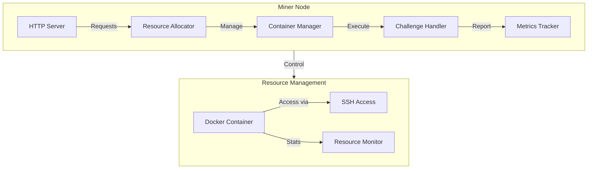
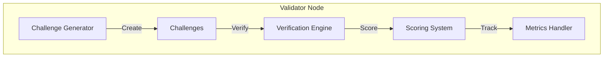

# Polarise Compute Subnet Documentation

## System Overview
Polarise Compute Subnet is a distributed computing system enabling secure resource sharing through containerized environments with validation capabilities. The system comprises Miner nodes providing compute resources and Validator nodes ensuring resource claims through challenge-based verification.

## Architecture

### Miner Node Architecture


### Validator Node Architecture


## Components

### 1. Container Management
```python
class ContainerManager:
    def run_container(self, resources: Dict[str, Any]) -> Dict[str, Any]:
        """
        Creates and manages Docker containers with:
        - Resource limits (CPU, Memory)
        - SSH access
        - Monitoring capabilities
        - Challenge execution environment
        """
```

Key Features:
- Dynamic container creation
- Resource limitation enforcement
- SSH access setup
- Performance monitoring
- Challenge execution support

### 2. Resource Allocation
The Resource Allocator handles:
- Resource request validation
- Container allocation
- Resource tracking
- Challenge processing

### 3. Challenge System
Types of Challenges:
1. Compute Challenges
   - CPU stress testing
   - Performance verification
   - Utilization monitoring

2. Memory Challenges
   - Memory allocation testing
   - Usage verification
   - Capacity validation

### 4. Verification System
The verification process:
1. Challenge Generation
2. Resource Monitoring
3. Performance Verification
4. Score Calculation

## API Reference

### Resource Management

#### 1. Allocate Resources
```http
POST /allocate
{
    "memory": "2g",
    "cpu_count": 2,
    "devices": []
}

Response:
{
    "status": "success",
    "container_id": "string",
    "container_name": "string",
    "password": "string",
    "ssh_port": "string",
    "host": "localhost",
    "username": "root"
}
```

#### 2. Process Challenge
```http
PUT /challenge/{container_id}
{
    "type": "compute|memory",
    "data": {
        "command": "string",
        "duration": number,
        "expected_cpu": number
    }
}

Response:
{
    "status": "success",
    "type": "string",
    "command_result": {
        "status": "string",
        "exit_code": number,
        "output": "string"
    },
    "metrics": {
        "cpu_usage": number,
        "memory_usage": number,
        "memory_limit": number,
        "memory_percent": number
    }
}
```

#### 3. Get Container Status
```http
GET /containers
Response: List of active containers and their states
```

## Installation & Setup

### Prerequisites
- Python 3.8+
- Docker
- SSH client

### Installation Steps
```bash
# Clone repository
git clone https://github.com/BANADDA/polarise-compute-subnet

# Create virtual environment
python -m venv venv
source venv/bin/activate  # Linux/Mac
venv\Scripts\activate     # Windows

# Install dependencies
pip install docker
pip install pyyaml
pip install cryptography
pip install requests
```

### Configuration
```yaml
# config/config.yaml
network:
  port: 8080
  host: "0.0.0.0"

security:
  secret_key: "your-secret-key"
  token_expiry: 3600

docker:
  base_image: "ubuntu:latest"
  container_prefix: "polarise-"
  default_memory: "1g"
  default_cpu_count: 1
```

## Usage Guide

### Starting the System
```bash
# Start main server
python main.py

# Run validator tests
python tests/test_validator.py
```

### Resource Allocation
```python
# Request resources
response = requests.post(
    'http://localhost:8080/allocate',
    json={
        "memory": "2g",
        "cpu_count": 2
    }
)

# Connect to container
# ssh root@localhost -p <ssh_port>
```

### Validation Process
1. Container receives challenge
2. Executes stress test
3. Collects metrics
4. Reports results
5. Receives score

## Testing System

### Allocation Testing
```python
# tests/test_allocation.py
- Tests resource allocation
- Verifies container creation
- Checks SSH access
- Validates resource limits
```

### Validation Testing
```python
# tests/test_validator.py
- Tests challenge generation
- Verifies resource usage
- Checks scoring system
- Validates metrics
```

## Security Features

### Container Security
- Resource isolation
- SSH key management
- Network isolation
- Access control

### Challenge Verification
- Resource monitoring
- Performance validation
- Usage verification
- Score calculation

## Monitoring & Metrics

### Resource Metrics
- CPU usage tracking
- Memory utilization
- Network statistics
- Performance scores

### Challenge Results
- Execution status
- Performance metrics
- Resource utilization
- Validation scores

Would you like me to:
1. Add more implementation details?
2. Expand the security section?
3. Include troubleshooting guides?
4. Add deployment scenarios?